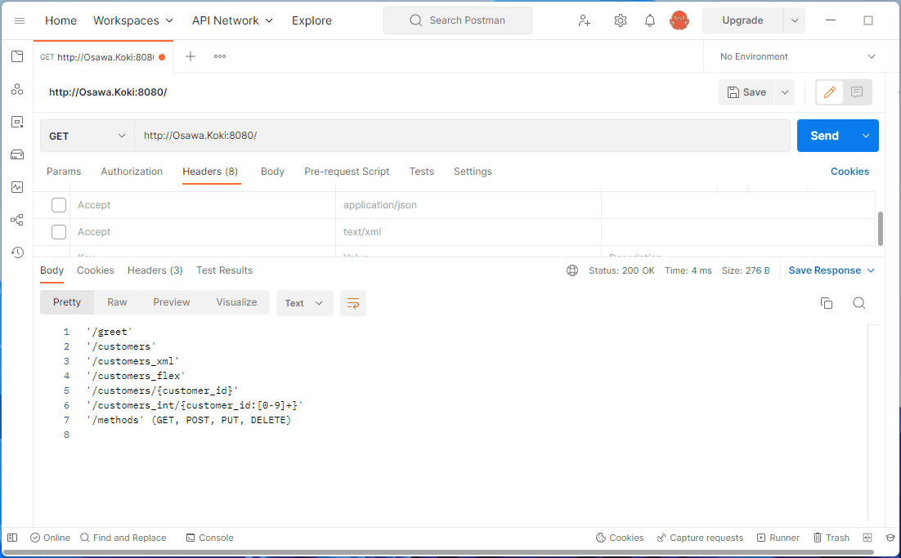

# simple-REST.go

> **Warning**  
> [gorilla](https://github.com/gorilla#gorilla-toolkit)は2022年10月でサポートが停止されています。  

Go言語(gorilla/mux)でRESTAPIを構築するサンプルプログラム。  
[gorilla](https://github.com/gorilla/mux)  

  

## 説明

コードは「app」ディレクトリ内の「app.go」と「handlers.go」。  
「app.go」ではURLルーティングでリクエストと関数を紐づけ、「handlers」ではリクエストに紐づけられて実行される関数を定義している。  

その他説明はコード内にコメントアウトとして記載。  

## 実行方法

```shell
# デバグ実行
go run main.go

# ビルド
go build -a -x -o bin main.go
```

Dockerfileから実行する場合には以下のコマンドを実行。  

```shell
docker build -t my-golang-app .
docker run -p 8080:80 -it --rm --name my-running-app my-golang-app
```

<http://localhost:8080>へアクセス。  

## デプロイ設定

| キー | バリュー |
| ---- | ---- |
| Name | simple-rest-go |
| Region | Oregon(US West) |
| Branch | main |
| Root Directory |  |
| Environment | Docker |
| Dockerfile Path | ./Dockerfile |
| Docker Build Context Directory |  |
| Docker Command |  |
